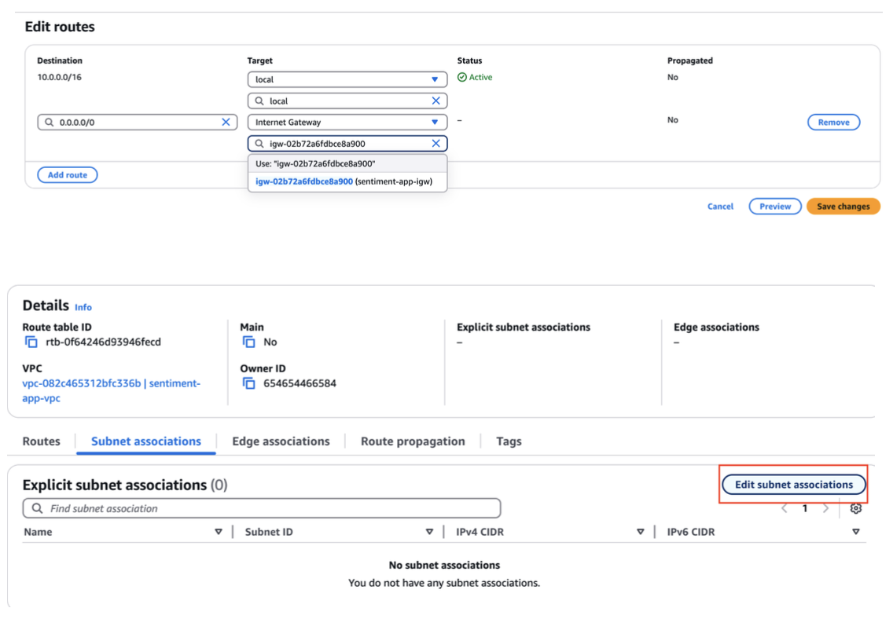
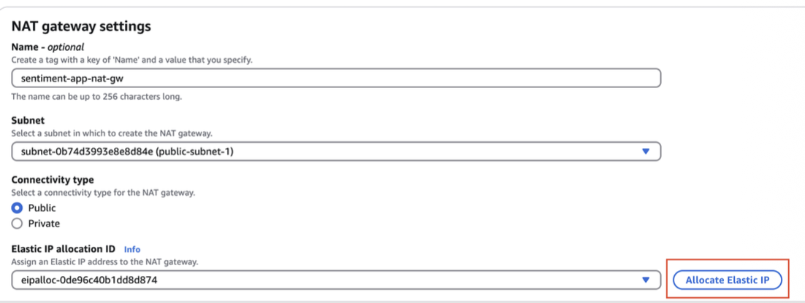

# Introduction

This lab course introduces essential cloud computing concepts for MLOps, using
Amazon Web Services (AWS) cloud platform. We will explore key AWS services and
their roles in creating a robust MLOps infrastructure.

### AWS services & tools
1. Identity and Access Management (IAM)
2. AWS CLI
3. Amazon Simple Storage Service (S3)
4. Elastic Container Registry (ECR)
5. Virtual Private Cloud (VPC)
6. Elastic Container Service (ECS)
7. AWS Fargate
8. AWS CloudWatch

**If you are using your own account**, start from the beginning. Cost will be under $1
total, and we will set up billing monitoring and alerts. You will start by configuring
security and permissions via IAM.

OR 

**If you are using AWS Educate**, start from section 1.3, as it doesn't allow IAM
configuration. Section 1.4 also can be omitted.

This lab concerns using AWS Console and manual setup, to get a good feeling of
how AWS operates visually. This way, you can interactively set up cloud services,
experiment with architecture, and introduce experimental infrastructure changes. In
the next lab, we will use Infrastructure as Code (IaC) approach to implement modular
and versioned configuration for some services used here.

## 1. Account setup & IAM configuration
When starting with a cloud, it is crucial to set up your AWS account properly for
security and cost control. By default, you use the root account, which is not
recommended due to its unrestricted access and auditing difficulties. Thus, we will
start with securing access, creating administrative IAM user, and implementing
billing alerts. Identity and Access Management (IAM) is the core AWS service for
authorization & authentication of users and services.

### Why do we need this?
1. **Least privilege principle** - you should always use the smallest set of
permissions required for work.
2. **Security** - minimize attack surface, particularly in the case of compromised
credentials.
3. **Auditing** - a root account is challenging to control, track, and audit.
The root account has full access to all services, and its actions are hard to fully track
and audit, clearly breaking the least privilege principle. In fact, AWS recommends
removing all access keys for root accounts.

The root account has full access to all services, and its actions are hard to fully track
and audit, clearly breaking the least privilege principle. In fact, AWS recommends
removing all access keys for root accounts.

### 1.1 Enable Multi-Factor Authentication (MFA) for root account
1. Sign in to your root account and navigate to the Identity and Access
Management (IAM) service.
2. At the top of the IAM dashboard, locate the security recommendations.
3. Set up MFA by downloading (or using your already-installed) authenticator app
on your mobile device and following the on-screen instructions on the AWS
IAM page.

### 1.2 Create an administrative IAM user
1. In the IAM Console, click Create User and choose `I want to create an IAM
user`.
2. Specify the user details.
3. Create a new IAM group called **admin** and attach the policy
`AdministratorAccess`.
4. Add the new user to the **admin** group.
5. Review the user groups and confirm that the user appears with the
`AdministratorAccess` policy attached (via the admin group).
6. Before signing in with your new user, note the "Sign-in URL for IAM users in
this account" on the Dashboard. Since this URL is complicated, customize it
by creating an account alias.
7. Use another browser or an incognito window to navigate to the new URL and
sign in using your new IAM user.

**Important**: Set up an MFA for your administrator account.

**Note**: Do not lose or forget your root account credentials. Otherwise, you may need
to contact AWS support.

### 1.3 Connect to AWS using the CLI
1. Install the AWS CLI by following the [AWS CLI installation guide](https://docs.aws.amazon.com/cli/latest/userguide/getting-started-install.html) and verify the
installation with `aws --version`.
2. In the IAM Console, select your new user and navigate to the **Security
Credentials** tab.
3. Create a new access key and store it securely (treat it like a password—do not
share it!).
4. When you start your **awsadacemy** session under AWS Details the access keys
will be displayed. Copy them and also the session token and paste to ~/.aws/credentials. When using `aws configure` it will ask you only for access key and secret key, but you also need to add the session token manually. The file should look like this:
```ini
[default]
aws_access_key_id = YOUR_ACCESS_KEY
aws_secret_access_key = YOUR_SECRET_KEY
aws_session_token = YOUR_SESSION_TOKEN # not needed if you are using you private account
region = YOUR_REGION # e.g., us-east-2 or eu-west-1
```

**Additional references**:
- [Root user best practices](https://docs.aws.amazon.com/IAM/latest/UserGuide/root-user-best-practices.html)
- [Root user tasks](https://docs.aws.amazon.com/IAM/latest/UserGuide/id_root-user.html#root-user-tasks)

### 1.4 Set up billing alerts
1. Navigate to the **Billing and Cost Management** dashboard from the AWS
Management Console.
2. Activate access to billing data by navigating to Billing Dashboard ->
Preferences, check the box for "Receive Billing Alerts" and save the changes.
3. Set up a billing budget. Choose the "Cost budget" template, set a monthly limit
(e.g. $5), and configure it to monitor actual costs.
4. Add an email notification by entering your email address to receive alerts
when costs approach or exceed the budget.

**Additional references**:
- [What is cost management](https://docs.aws.amazon.com/cost-management/latest/userguide/what-is-costmanagement.html)
- [Creating a budget](https://docs.aws.amazon.com/cost-management/latest/userguide/budgets-create.html)

## 2. Amazon S3 setup and file management
AWS Simple Storage Service (S3) is an object storage, designed for storing arbitrary
objects (bytes) identified by a string key. It is a core AWS storage, and main storage
used in MLOps, e.g. for datasets, ML model artifacts, and training logs. It offers
scalability, versioning, and integration with other AWS services.

### Why do we need this?

1. **Object storage** - very convenient, and ideal for storing large ML objects, e.g.
dataset files or models.
2. **Scalability & low cost** - S3 scales automatically and basically infinitely. It also
only charges for storage used and requests made, and is the cheapest
storage available.
3. **Versioning & archiving** - you can configure objects versioning, use long-term
archiving options, and set lifecycle policies. Those options allow rich, yet easy
to use management.

### 2.1 Create an S3 bucket
1. Navigate to the **S3 Console**.
2. Click **Create bucket** and enter a globally unique bucket name. Note that S3
has a global namespace for buckets. Thus, your bucket name must be unique
worldwide, across all AWS regions and buckets.
3. Leave all default configurations as-is.

### 2.2 Upload files to S3 bucket
1. Download the necessary files from [Google Drive](https://drive.google.com/file/d/1NRZdYq5jweVRUzAZG518LMhs4E56IgxG/view).
2. Upload these files to the newly created S3 bucket.

### 2.3: Integrate S3 into an ML workflow
1. In your sentiment analysis application (from Lab 1 homework), remove any
previously downloaded files from Google Drive.
2. Write script that uses `boto3` to download the necessary files from your S3 bucket to your local artifacts
   location (place from where you load the models). We are assuming localhost for now as a CI/CD environment
   is not yet set up. We will work on it in future labs.
3. Run your sentiment analysis application to verify that it works correctly with files downloaded from S3.
4. Keep it exposed on port 8000. 

**Additional references**:
- [Amazon S3](https://aws.amazon.com/s3/)
- [Boto3](https://boto3.amazonaws.com/v1/documentation/api/latest/reference/services/s3.html)

## 3. Elastic Container Registry (ECR) & Docker management
ECR is a managed Docker registry in AWS, similar in concept to [Dockerhub](https://hub.docker.com/). It
provides secure, scalable storage for your Docker images, tightly integrated with
other AWS services.

### Why do we need this?

1. **Versioning** - you can manage and version your Docker images easily.
2. **Security** - it's integrated with IAM and supports KMS encryption, helping with
the least principle privilege.
3. **Integration** - seamlessly integrates with other AWS services like ECS, with
Docker images being simply "visible" to other services after permissions
setup.

## 3.1: Create an ECR repository 
1. Navigate to **ECR -> Repositories** in the AWS Console.
2. Click **Create Repository**.
3. Choose to use **AES-256 encryption**.
4. Remember, it's a good practice to create separate repositories for each
application. This helps with management and versioning (through tagging
systems).

## 3.2: Authenticate your Docker client to ECR 
1. Run the following command. Replace `<placeholders>` with your actual region
and account details. You can also find this command in ECR when you click
on your repository.


```bash
aws ecr get-login-password --region <region> | docker login
--username AWS --password-stdin
<aws_account_id>.dkr.ecr.<region>.amazonaws.com
```

## 3.3: Build and push a Docker image to ECR
1. Navigate to your sentiment analysis application directory.
2. Our models are quite small, so we can store them directly in our docker image. Make sure your Dockerfile copies the necessary files from the local disk to the image.
```dockerfile
COPY ./models /app/<your-models-paths-from-where-you-load-them>
```
3. Build a Docker image using the Dockerfile in your application. Tag the image with your ECR
repository URI.
```bash
docker tag sentiment-app
<aws_account_id>.dkr.ecr.<region>.amazonaws.com/<your-reposito
ry-name>:14.01.25 
```
3. Push the Docker image to your ECR repository.
```bash
docker push
<aws_account_id>.dkr.ecr.<region>.amazonaws.com/<your-reposito
ry-name>
```

**Additional references**:
- [What is ECR](https://docs.aws.amazon.com/AmazonECR/latest/userguide/what-is-ecr.html)

## 4. Virtual Private Cloud (VPC) configuration
A VPC provides a logically isolated network environment for your AWS resources.
This offers complete control over IP ranges, subnets, routing, and security. Such
isolation can often be required for MLOps in regulated industries, e.g. in finance,
biomedical applications, or legal applications.

### Why do we need this?

1. **Isolation** - resources are isolated by default, ensuring only authorized traffic
reaches them.
2. **Control** - customize IP ranges, subnets, route tables, and gateways.
3. **Scalability** - plan for future growth with proper IP planning and range
management.
4. **Flexibility** - you can configure both public and private subnets, exposing only
necessary parts.

### 4.1 Create a new VPC 
1. Go to the **VPC Console** in the AWS Management Console. As you can see, one
default VPC is already created by AWS, but we will create our own.
2. Configure the following: 
* **Name**: sentiment-app-vpc.
* **IPv4 CIDR Block**: Use `10.0.0.0/16`. This has `~65,536 IP addresses`,
see e.g. `cidr.xyz` for details.
* **Tenancy**: Select Default unless dedicated hardware is required.

**Additional references**:
* [What is AWS VPC?](https://docs.aws.amazon.com/vpc/latest/userguide/what-is-amazon-vpc.html)

### 4.2 Create public and private subnets
Subnets divide your VPC into smaller segments with specific roles, e.g. public-facing
or private backend. For this setup, we will create two public subnets and two private
subnets across multiple Availability Zones (AZs) for high availability.

#### 4.2.1 Create public subnets
1. In the **VPC Console**, navigate to Subnets and click `Create Subnet`.
2. Configure for each public subnet:
* **Name**: e.g., `public-subnet-1` and `public-subnet-2`.
* **Availability Zone**: Choose different AZs (e.g., eu-west-1a and
eu-west-1b) for redundancy.
* **IPv4 CIDR Block**: e.g., `10.0.1.0/24` for `public-subnet-1` and
`10.0.2.0/24` for `public-subnet-2`.

#### 4.2.2 Create private subnets
1. Repeat the process for private subnets:
* **Name**: e.g., `private-subnet-1` and `private-subnet-2`.
* **IPv4 CIDR Block**: e.g., `10.0.3.0/24` for `private-subnet-1` and
`10.0.4.0/24` for `private-subnet-2`.

**Additional references**
* [Subnets for your VPC](https://docs.aws.amazon.com/vpc/latest/userguide/configure-subnets.html)

### 4.3 Set up an Internet Gateway
Internet Gateway enables resources in public subnets to send/receive traffic to/from
the internet.

1. Navigate to **Internet Gateways** in the **VPC Console**.
2. Click `Create Internet Gateway`.
3. Name it (e.g., sentiment-app-igw).
4. Attach **IGW** to our new **VPC**.

**Additional references**
* [Enable VPC internet access using internet gateways](https://docs.aws.amazon.com/vpc/latest/userguide/VPC_Internet_Gateway.html)

### 4.4 Configure route tables
Public route tables enable external communication for public subnets, while private
route tables keep backend resources isolated.

#### 4.4.1 Create and configure a public route table
1. In the **VPC Console**, go to **Route Tables** and create a new route table (e.g.,
`public-route-table`).
2. Associate this table with your public subnets (`public-subnet-1` and
`public-subnet-2`).


3. Add a route to allow internet access:
* **Destination**: `0.0.0.0/0`
* **Target**: Select the Internet Gateway created earlier (`igw-id`)

#### 4.4.2 Create and configure a private route table
1. Create another route table (e.g., `private-route-table`).
2. Associate it with your private subnets (`private-subnet-1` and
`private-subnet-2`).
3. Leave it without routes for now until we set up a NAT Gateway in the next section.

**Additional references**
* [Configure route tables](https://docs.aws.amazon.com/vpc/latest/userguide/VPC_Route_Tables.html)

### 4.5 Set up a NAT Gateway
NAT Gateway allows instances in private subnets to access the internet without
exposing them to inbound traffic. It ensures that private instances can initiate
outbound connections without being directly exposed, allowing e.g. accessing online
APIs, models, or updating other web-based services with predictions.

1. In the **VPC Console**, navigate to **NAT Gateways** and click `Create NAT
Gateway`.
2. Select one of your public subnets (e.g., `public-subnet-1`).
3. Allocate a new Elastic IP address for the NAT Gateway.

4. Update the private route table to route internet-bound traffic through the NAT
Gateway:
* **Destination**: `0.0.0.0/0`.
* **Target**: Select the NAT Gateway created earlier (`nat-gw-id`).

**Additional references**
* [NAT gateways](https://docs.aws.amazon.com/vpc/latest/userguide/vpc-nat-gateway.html)

### 4.6 Security Groups
Security groups act as virtual firewalls at the instance level. Their stateful nature
means that when an inbound rule permits traffic, the corresponding outbound
response is automatically allowed.

We need two Security Groups. It is good practice to keep all private resources in a
private firewall, but to address public access to our app we need to place ALB in the
public Security Group.

**Load Balancer Security Group**
* **Inbound Rules**: Allow TCP traffic (port80) from anywhere (0.0.0.0/0).
* **Outbound Rules**: By default, allow all outbound traffic, so instances can reach external
services.

**Resource Security group**
* **Inbound Rules**: Allow TCP traffic (port `8000`) from Load Balancer Security Group.
* **Outbound Rules** : By default, allow all outbound traffic, so instances can reach external services.

**Additional references**
* [Security groups for your VPC](https://docs.aws.amazon.com/vpc/latest/userguide/vpc-security-groups.html)

### 4.7 Set up an Application Load Balancer (ALB)
Application Load Balancer (ALB) distributes incoming traffic across multiple targets
to avoid overloading a single instance with traffic, which minimizes latency and
maximizes throughput. Targets can be e.g. EC2 instances, ECS Fargate containers,
and other traffic-serving servers.

#### 4.7.1 Target Group
1. In the **EC2 Console**, navigate to **Target Groups** and click `Create Target
Group`.
2. Configure the following:
* **Target type**: Select `IP addresses` (since we will use Fargate later).
* **Name**: e.g., `sentiment-app-target-group`.
* **Protocol**: `HTTP`.
* **Port**: `8000` (the port our application listens on).
* **Health checks**: Use healthcheck endpoint from your sentiment app.
* **Target registration**: Leave empty for now; we will register ECS tasks as targets later.

#### 4.7.2 Create the ALB
1. In the **EC2 Console**, navigate to **Load Balancers** and click `Create Load
Balancer`.
2. Select `Application Load Balancer`.
3. Configure the following:
* **Name**: e.g., `sentiment-app-alb`.
* **Scheme**: `Internet-facing` if you want public access. We are choosing `internet-facing` for this lab because we need to call our app from outside the VPC.
* **IP address type**: `IPv4`.
* **Availability Zones**: Select the VPC created earlier and both public subnets.
* **Security Groups**: Select the Load Balancer Security Group created earlier.
4. Add a listener for HTTP (port 80). It allows the world to
communicate with our ALB. 
* **Protocol**: `HTTP`.
* **Port**: `80`.
* **Default action**: Forward traffic to the Target Group created earlier.

**Additional references**
* [Application Load Balancer Behind the Scenes](https://www.reddit.com/r/aws/comments/cwbkw4/behind_the_scenes_what_is_an_aws_load_balancer/)

## 5. AWS Fargate deployment & CloudWatch configuration
**AWS Fargate** is a serverless compute engine that lets you run containers without
managing underlying EC2 instances. It allows you to automatically scale up and
down based on demand, which is very useful for MLOps, where we typically must
scale horizontally, since model inference requires the whole CPU.

**AWS ECS** is a fully managed container orchestration service that enables you to
deploy, manage, and scale containerized applications on AWS.

**Together** ECS decides what to run and when, while Fargate supplies the compute
resources and execution environment in a pay-as-you-go model, with automatic
scaling and strong task isolation.

### Why use AWS Fargate?

1. **Serverless** - no need to manage servers or clusters, reducing operational overhead.
2. **Simplified Management** - AWS handles patching, scaling, and infrastructure maintenance.

### 5.1 Create an ECS Cluster
1. Navigate to the **ECS Console** and click `Create Cluster`.
2. **Infrastructure**: skip it for now, we will define fargate later in task definition.
3. **Cluster Name**: e.g., `sentiment-app-cluster`.
4. Leave other settings as default and create the cluster.

### 5.2 Create a Task Definition
A task definition is a blueprint for your application. It tells ECS how to run your
containers and encapsulates all settings needed for deployment.

1. In the **ECS Console**, navigate to **Task Definitions** and click `Create Task
Definition`.
2. Select `Fargate` as the launch type.
3. Configure the following:
* **Task Definition Name**: e.g., `sentiment-app-task`.
* **Operating System**: `Linux/X86_64`.
* **CPU/Memory**: Choose `1 vCPU` and `3 GB` memory.
* **Task Role**: `labrole`
* **Task Execution Role**: `labrole`
* **Container Definitions**: Click `Add container` and configure:
  * **Container name**: e.g., `sentiment-app-container`.
  * **Image**: Use the ECR image URI pushed earlier.
  * **Port mappings**: Map container port `8000` to host port `8000`.
4. Leave other settings as default and create the task definition.

### 5.3 Create a Service
An ECS service ensures your application runs continuously and scales automatically
based on demand.

1. In the **ECS Console**, navigate to your cluster and click `Create` under the **Services** tab.
2. Configure the following:
3. **Launch Type**: `Fargate`.
4. **Service Name**: e.g., `sentiment-app-service`.
5. **Number of tasks**: `2` (for high availability).
6. **Cluster VPC**: Select the VPC created earlier.
7. **Subnets**: Select both private subnets.
8. **Security Groups**: Select the Resource Security Group created earlier.
9. **Load Balancing**: Enable and select the ALB and Target Group created earlier.
10. Leave other settings as default and create the service.

### 5.4 Running the service
1. After creating the service, ECS will start launching tasks based on the task definition.
2. Navigate to the **Tasks** tab in your cluster to monitor the status of your tasks.
3. Once the tasks are running, your application should be accessible via the ALB's DNS name.
4. If you wait suspiciously long (>10 min), then go to the events section and check out potential issues.

### 5.5 Access the application
1. Navigate to the **EC2 Console** and find your Load Balancer.
2. Copy the **DNS name** of the Load Balancer.
3. Open a web browser and paste the DNS name to access your sentiment analysis application.

**Additional references**:
* [AWS Fargate getting started](https://aws.amazon.com/fargate/getting-started/).

## 6. Application testing and monitoring
After deploying your service, ensure everything is working properly. At this point, all
cloud-related work is done, and from the outside perspective, the service is just
another REST service.

### 6.1 Test the application
1. Validate that all endpoints respond as expected by writing a Python script with
appropriate tests for automated testing. You can either navigate to /docs endpoint to
display all available options and make requests or just make curl POST call.
2. Check CloudWatch for logs, metrics, and any alarms that indicate issues. This is the
basic monitoring service at AWS, and the basis of its observability services and
platforms.

## 7. Documenting the lab

As homework, you are expected to complete this entire lab. You can take
screenshots or just record your screen where you are showing all the resources you
created with the correct configuration and the working API with valid responses.